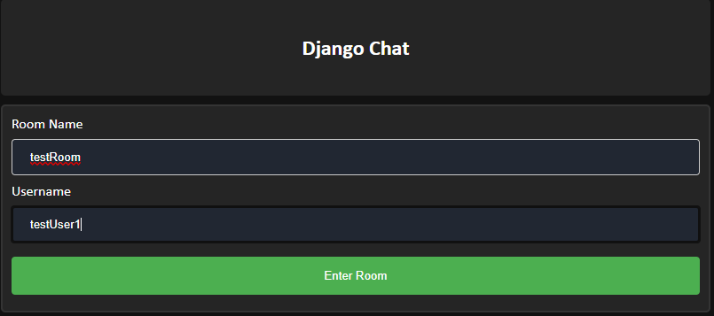

# django-chatapp

Simple chat app written in Python/Django/JavaScript/Ajax without the use to WebSocket or Channels

## Table of Contents

1. [About](#about)
2. [Prerequisites](#prerequisites)
3. [Installation](#installation)
4. [Screenshots](#Screenshots)
5. [Links](#links)

## About

A small functional message application built using Django. Users can enter rooms with unique username and post realtime messages. Everything from the rooms and users are not secure and this is meant to just practice using Ajax to update and pull live data from the server.

## Prerequisites

1. Python 3.9+ **[Download](https://www.python.org/downloads/)**
2. Django 3.2+ **[Download](https://www.djangoproject.com/download/)**

## Installation

1. Clone, and run

```bash
$ git clone https://github.com/tu-nguyen/django-chatapp.git && cd django-chatapp
$ python manage.py runserver
```

## Screenshots

[](screenshots/example1.PNG)
[](screenshots/example2.PNG)

[](screenshots/example3.PNG)
